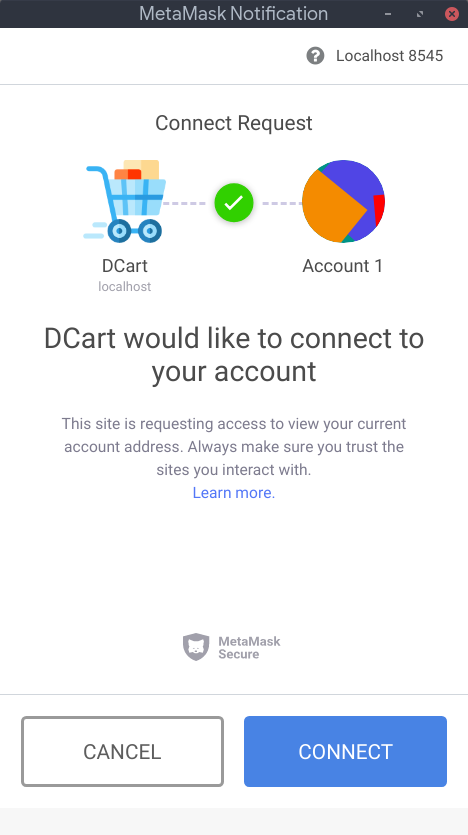
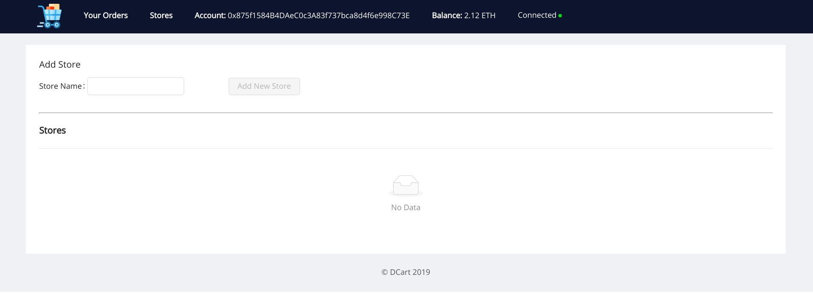
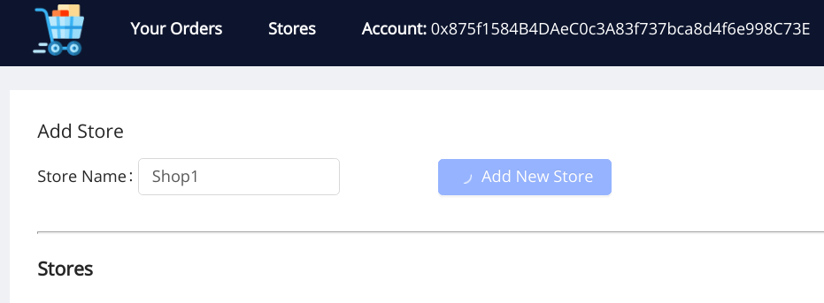
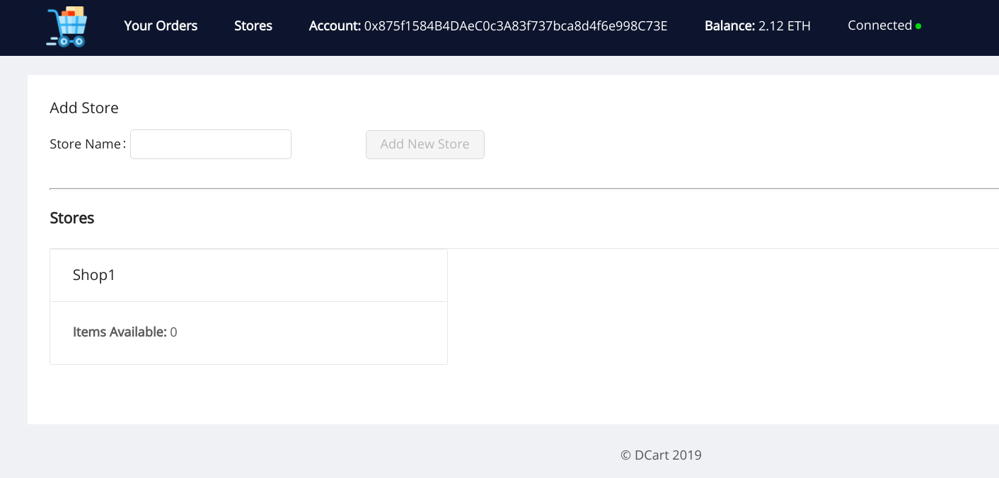
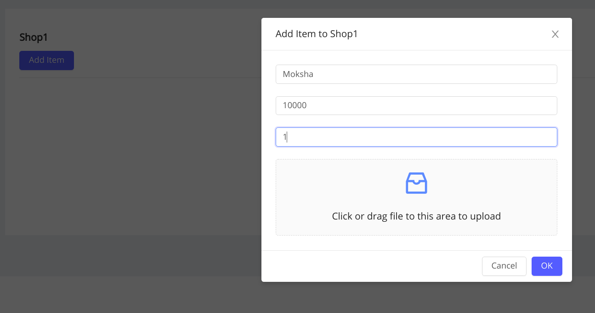
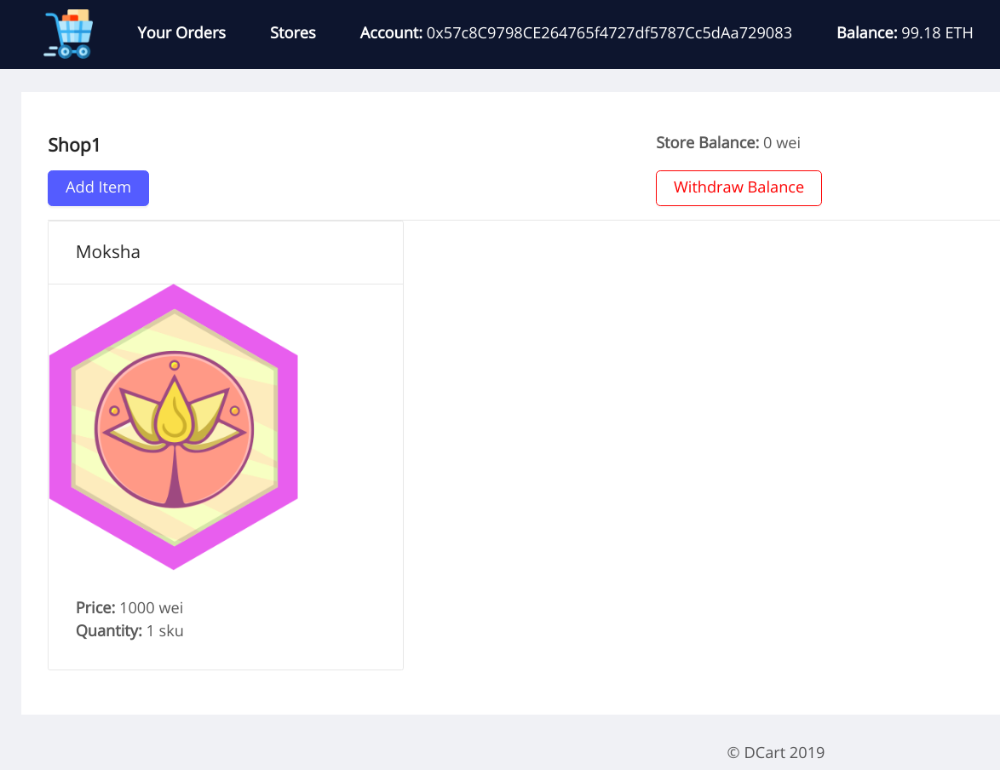
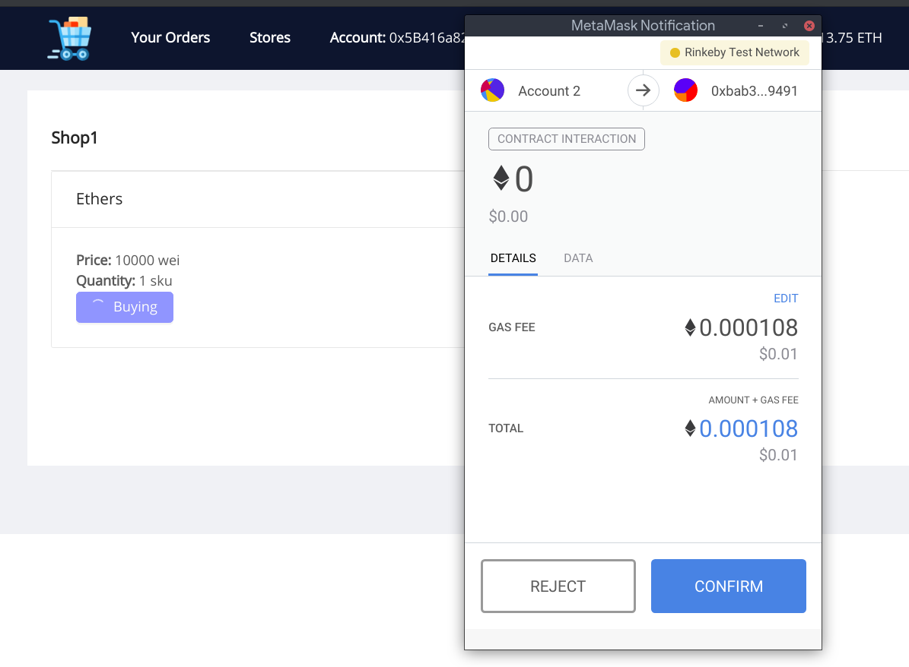
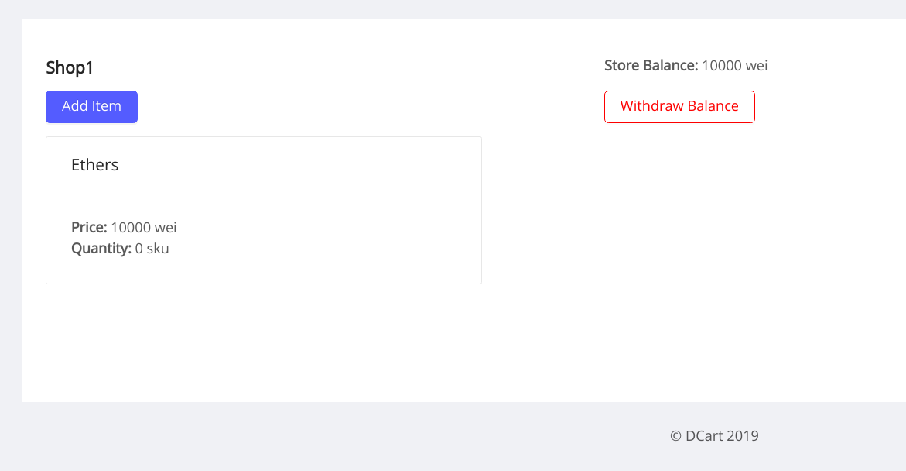
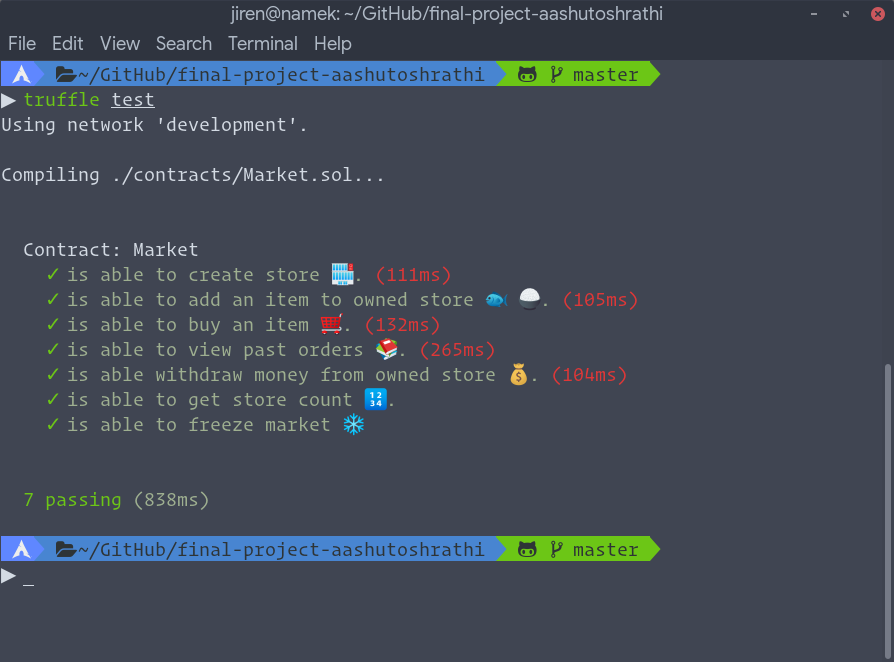

<p align="center"><p>

<h1 align="center"> DCart </h1> 
<p align="center">
<a href="https://travis-ci.org/aashutoshrathi/dcart">
    
</a>
</p>
<p align="center">Decentralized Online Market Prototype.</p>
<hr>

### What is DCart 🛒 ?

DCart is a proof of concept for decentralized market, which removes middlewares, authorities and ofcourse scope of curroption. DCart enables buying and selling of product with bare minimum computations and hence lower gas ⛽. Uses **IPFS** for storing images.

#### The Problem 😞

In Web2 based online stores, we have lots of extra charges, plus incentive to buyers and charges for hosting middleware were to be paid by users.
Plus, since we are not taking any data, all your purchase history will be yours only. You can always interact with store

### Screenshots



|         Main Page         |         Adding Store         |
| :-----------------------: | :--------------------------: |
|  |  |

|         Store Added         |        Store Page         |
| :-------------------------: | :-----------------------: |
|  |  |

|          Add Item Form           |         Item Added         |
| :------------------------------: | :------------------------: |
|  |  |

| Buying from another account |    Store after transactions     |
| :-------------------------: | :-----------------------------: |
|  |  |


#### External Contracts Used :bookmark_tabs:

- [Stoppable](contracts/Stoppable.sol)
- [SafeMath](contracts/SafeMath.sol)
- [Ownable](contracts/Ownable.sol)

## Development :hammer_and_wrench:

#### Prerequisites

Development Setup:

(Last 4 things matter, rest is show off)

`````sh
                   -`                    jiren@namek
                  .o+`                   -----------
                 `ooo/                   OS: Arch Linux x86_64
                `+oooo:                  Host: X556UF 1.0
               `+oooooo:                 Kernel: 4.20.3-arch1-1-ARCH
               -+oooooo+:                Uptime: 8 hours, 24 mins
             `/:-:++oooo+:               Packages: 1220 (pacman), 2 (dpkg)
            `/++++/+++++++:              Shell: zsh 5.6.2
           `/++++++++++++++:             Resolution: 1920x1080
          `/+++ooooooooooooo/`           DE: GNOME 3.30.2
         ./ooosssso++osssssso+`          WM: GNOME Shell
        .oossssso-````/ossssss+`         WM Theme: Arc-Dark
       -osssssso.      :ssssssso.        Theme: Arc-Dark [GTK2/3]
      :osssssss/        osssso+++.       Icons: Papirus-Dark [GTK2/3]
     /ossssssss/        +ssssooo/-       Terminal: gnome-terminal
   `/ossssso+/:-        -:/+osssso+-     CPU: Intel i5-6200U (4) @ 2.800GHz
  `+sso+:-`                 `.-/+oso:    GPU: NVIDIA GeForce 930M
 `++:.                           `-/+/   GPU: Intel Skylake GT2 [HD Graphics 520]
 .`                                 `/   Memory: 5914MiB / 11869MiB
                                         NodeJS: v8.15.0
                                         npm: v6.7.0
                                         Truffle: v5.0.2
                                         Ganache CLI: v6.2.5
                                         IPFS API: v26.1.2
`````

### Develop Locally

- Clone the project locally

```sh
git clone https://github.com/dev-bootcamp-2019/final-project-aashutoshrathi.git
cd final-project-aashutoshrathi
```

- Start local development blockchain and copy the mnemonic to be used later

```sh
ganache-cli
```

- Compile contracts and migrate them to the blockchain

```sh
npm i
truffle compile
truffle migrate
```

#### Setup React

Frontend is React with Web3 with the help of Truffle boxes.

```sh
cd client
npm i
npm run start
```

### Run Tests

```sh
truffle test
```



### Checklist (For ease of reviewer)

- [x] Project includes a README.md that explains the project.
- [x] The project is a Truffle project that allows you to easily compile, migrate and test the provided Solidity contracts.
- [x] Project is commented as outline in the documentation.
- [x] At least one contract uses a library or inherits from another contract - Actually 3.
- [x] I can run the app on a dev server locally for testing/grading (connecting to Rinkeby if required).
- [x] I can visit a URL and interact with the app (can be localhost).
- [x] The app displays the current ethereum account.
- [x] I can sign transactions using Metamask (or uPort).
- [x] The app interface reflects updates to to the contract state.
- [x] 7 tests written in Javascript or Solidity (or both).
- [x] Tests are explained with brief code comments.
- [x] Tests are properly structured.
- [x] All tests pass 🎉.
- [x] At least one of the contracts implements a circuit breaker / emergency stop pattern.
- [x] Project includes a file called [design_pattern_desicions.md](design_pattern_desicions.md) that explains some of the design decisions made by the author.
- [x] [design_pattern_desicions.md](design_pattern_desicions.md) adequately describes the design patterns implemented in the project.
- [x] Project includes a file called [avoiding_common_attacks.md](avoiding_common_attacks.md) that explains what measures you took to ensure that your contracts are not susceptible to common attacks.
- [x] The [avoiding_common_attacks.md](avoiding_common_attacks.md) covers at least 3 common attacks and how the app mitigates user risk.
- [x] Project includes a file called [deployed_addresses.txt](deployed_addresses.txt) that describes where the deployed testnet contracts live (which testnet and address).
- [x] **Project uses IPFS** to store images for items on sale.
- [ ] The project uses and upgradable design pattern for the smart contracts.
- [ ] At least one contract is written in Vyper or LLL.
- [ ] The app uses uPort for user authentication and/or signing and sending transactions.
- [ ] The app uses the Ethereum Name Service to resolve human readable names to Ethereum addresses (in progress).
- [ ] The project uses an Oracle service such as Oraclize.

### ToDo

- [ ] Add 404 for trash URLs.
- [ ] Add Admin Dashboard.
- [ ] Add GUI for Freezing Market.
- [ ] Add Edit Item option.
- [ ] Make My Orders more detailed.
- [ ] Store more stuff on IPFS API by Infura.

---

<p align="center>
Icon Credits: Icons made by <a href="https://www.freepik.com/" title="Freepik">Freepik</a> from <a href="https://www.flaticon.com/" title="Flaticon">www.flaticon.com</a> is licensed by <a href="http://creativecommons.org/licenses/by/3.0/" title="Creative Commons BY 3.0" target="_blank">CC 3.0 BY</a>
</p>

<p> Moksha Kudos taken from <a href="https://gitcoin.co/kudos/">Gitcoin Kudos</a></p>

---

<p align="center"> Made with ❤️ by <a href="https://github.com/aashutoshrathi">Aashutosh Rathi</a></p>
