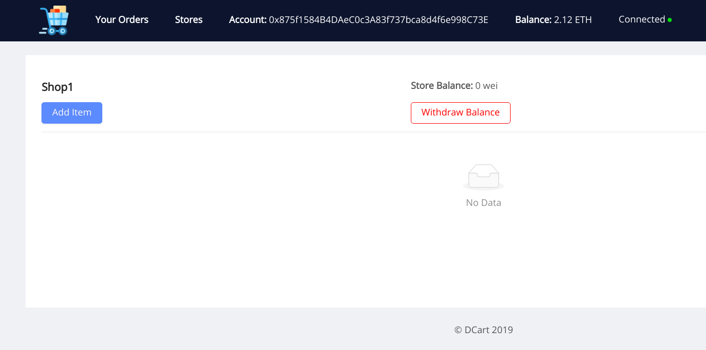

<p align="center"><p>

<h1 align="center"> DCart </h1> 
<p align="center">
<a href="https://travis-ci.org/dev-bootcamp-2019/final-project-aashutoshrathi">
    
</a>
</p>
<p align="center">Decentralized Online Market Prototype.</p>
<hr>

### What is DCart 🛒 ?

DCart is a proof of concept for decentralized market, which removes middlewares, authorities and ofcourse scope of curroption. DCart enables buying and selling of product with bare minimum computations and hence lower gas ⛽.

#### The Problem 😞

In Web2 based online stores, we have lots of extra charges, plus incentive to buyers and charges for hosting middleware were to be paid by users.
Plus, since we are not taking any data, all your purchase history will be yours only. You can always interact with store

### Screenshots


|         Main Page         |         Adding Store         |
| :-----------------------: | :--------------------------: |
|  |  |

|         Store Added         |        Store Page         |
| :-------------------------: | :-----------------------: |
|  |  |

|          Add Item Form           |         Item Added         |
| :------------------------------: | :------------------------: |
|  |  |

| Buying from another account |    Store after transactions     |
| :-------------------------: | :-----------------------------: |
|  |  |

#### External Contracts Used :bookmark_tabs:

- [Stoppable](contracts/Stoppable.sol)
- [SafeMath](contracts/SafeMath.sol)
- [Ownable](contracts/Ownable.sol)

## Development :hammer_and_wrench:

#### Prerequisites

Development Setup:

(Last 4 things matter, rest is show off)

`````sh
                   -`                    jiren@namek
                  .o+`                   -----------
                 `ooo/                   OS: Arch Linux x86_64
                `+oooo:                  Host: X556UF 1.0
               `+oooooo:                 Kernel: 4.20.3-arch1-1-ARCH
               -+oooooo+:                Uptime: 8 hours, 24 mins
             `/:-:++oooo+:               Packages: 1220 (pacman), 2 (dpkg)
            `/++++/+++++++:              Shell: zsh 5.6.2
           `/++++++++++++++:             Resolution: 1920x1080
          `/+++ooooooooooooo/`           DE: GNOME 3.30.2
         ./ooosssso++osssssso+`          WM: GNOME Shell
        .oossssso-````/ossssss+`         WM Theme: Arc-Dark
       -osssssso.      :ssssssso.        Theme: Arc-Dark [GTK2/3]
      :osssssss/        osssso+++.       Icons: Papirus-Dark [GTK2/3]
     /ossssssss/        +ssssooo/-       Terminal: gnome-terminal
   `/ossssso+/:-        -:/+osssso+-     CPU: Intel i5-6200U (4) @ 2.800GHz
  `+sso+:-`                 `.-/+oso:    GPU: NVIDIA GeForce 930M
 `++:.                           `-/+/   GPU: Intel Skylake GT2 [HD Graphics 520]
 .`                                 `/   Memory: 5914MiB / 11869MiB
                                         NodeJS: v8.15.0
                                         npm: v6.7.0
                                         Truffle: v5.0.2
                                         Ganache CLI: v6.2.5
`````

### Develop Locally

- Clone the project locally

```sh
git clone https://github.com/dev-bootcamp-2019/final-project-aashutoshrathi.git
cd final-project-aashutoshrathi
```

- Start local development blockchain and copy the mnemonic to be used later

```sh
ganache-cli
```

- Compile contracts and migrate them to the blockchain

```sh
npm i
truffle compile
truffle migrate
```

#### Setup React

Frontend is React with Web3 with the help of Truffle boxes.

```sh
cd client
npm i
npm run start
```

### Run Tests

```sh
truffle test
```


---

<p align="center>
Icon Credits: Icons made by <a href="https://www.freepik.com/" title="Freepik">Freepik</a> from <a href="https://www.flaticon.com/" title="Flaticon">www.flaticon.com</a> is licensed by <a href="http://creativecommons.org/licenses/by/3.0/" title="Creative Commons BY 3.0" target="_blank">CC 3.0 BY</a>
</p>

---

<p align="center"> Made with ❤️ by <a href="https://github.com/aashutoshrathi">Aashutosh Rathi</a></p>
